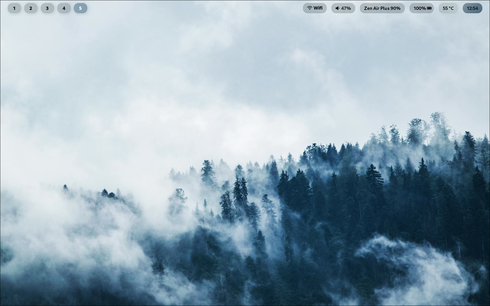
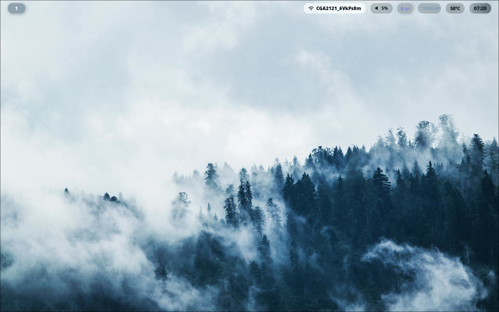
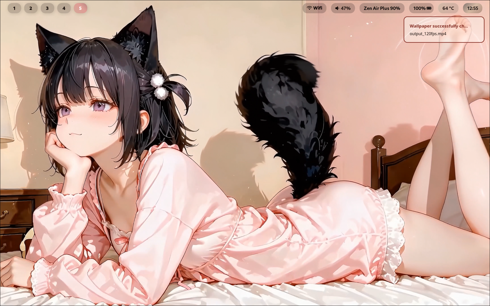
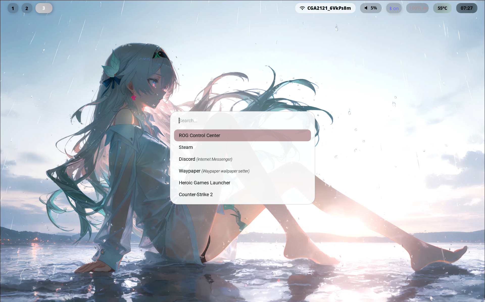
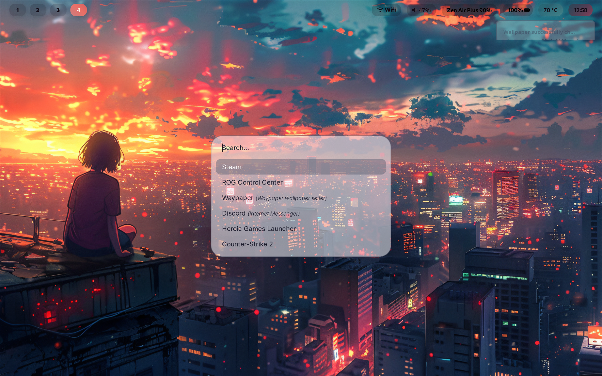

# 🌸 Glassy Hyprland Dotfiles

[](https://archlinux.org/)
[](https://hyprland.org/)

A beautifully customized, highly dynamic Hyprland setup for Arch Linux. Focused on seamless glassmorphism aesthetics, live video wallpapers, and 100% automated dynamic theming. 

### 📸 Desktop Overview

<table>
  <tr>
    <td></td>
    <td></td>
  </tr>
  <tr>
    <td colspan="2" align="center"></td>
    <td colspan="2" align="center"></td>
    <td colspan="2" align="center"></td>
  </tr>
</table>

---

## ✨ Key Features

* **True Dynamic Theming (`Wallust`)**: System colors are automatically generated on the fly. The custom scripts extract colors not only from static images but also grab frames from **.mp4 / .webm** video wallpapers to keep the theme perfectly synced.
* **Glassmorphism UI**: Waybar and Rofi feature a beautifully tuned, semi-transparent frosted glass effect that blends perfectly with bright and pastel wallpapers.
* **Live Video Wallpapers**: Powered by `Waypaper` + `mpvpaper`. Seamlessly cycle between `.jpg`, `.png`, `.mp4`, and `.gif` formats with a single keybind.
* **Animated Borders**: Active windows feature a smooth, infinitely rotating gradient border matching the current wallpaper palette.
* **Unified Ecosystem**: The dynamic colors automatically apply to:
    * Hyprland (Borders)
    * Waybar
    * Rofi (App Launcher)
    * Kitty (Terminal)

---

## 🧩 Components

* **Window Manager:** [Hyprland](https://hyprland.org/)
* **Bar:** [Waybar](https://github.com/Alexays/Waybar) (Custom Glassy CSS)
* **Launcher:** [Rofi-Wayland](https://github.com/lbonn/rofi)
* **Terminal:** [Kitty](https://sw.kovidgoyal.net/kitty/)
* **Wallpaper Manager:** [Waypaper](https://github.com/anufrievroman/waypaper) (with `mpvpaper` and `swaybg`)
* **Color Generator:** [Wallust](https://codeberg.org/explosion-mental/wallust) (using `kmeans` backend and `softlight` palette)

---

## ⌨️ Keybinds

Everything is designed to be controlled smoothly from the keyboard.

* `SUPER + Q` = Open Kitty Terminal
* `SUPER + W` = **Magic Keybind**: Cycle to the next wallpaper (Image or Video) in the directory, restart the background process, extract a new color palette via Wallust, and inject it into the entire system instantly.
* `SUPER + ALT + Space` = Open Rofi Menu
* *(Add your other favorite keybinds here)*

---

## ⚙️ Installation

1. Clone this repository to your home folder.
2. Ensure you have the required dependencies installed via `pacman` or `yay`:
   
   ```bash
   yay -S hyprland waybar rofi-wayland kitty waypaper mpvpaper swaybg wallust ffmpeg
3. Backup your existing configurations!

4. Copy the contents of the config folder to your ~/.config/ directory.

5. Place your favorite images and videos in ~/Pictures/wallpapers.

6. Press Super + W to initialize the dynamic theming script. Enjoy!
